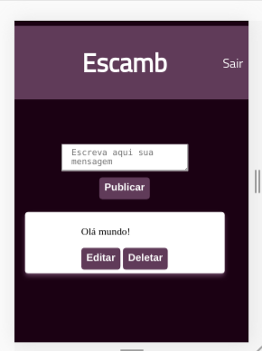
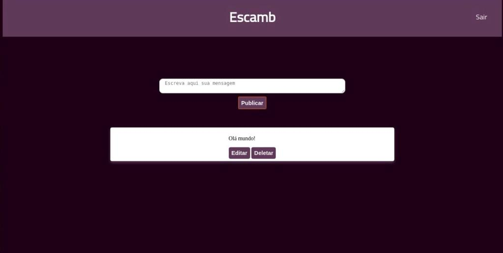

# Rede Social - Escamb
## O projeto
Neste projeto de Rede Social construímos uma cuja temática é **trocas**, no qual o objetivo é o usuário poder relacionar tanto objetos que queira trocar, bem como as experiências que queira interagir para aprender algo ensinando outra coisa em troca. 

## Características técnicas 
Nós utilizamos o HTML5, CCS3, JavaScript(ES6+) e LocalStorage para desenhar estrutura de dados que se relacionou com as funcionalidades geridas nas historias dos usuários. Também foi dado enfoque no mobile first, sendo para isso utilizado flexbox.
O sistema de rotas para trocar de uma tela para outra de maneira dinâmica (SPA), foi construído utilizando o hashchange onde o usuário inicia seu acesso pela tela de login, sendo direcionado direto ao feed da rede social através de e-mail e senha ou de cadastrar-se através do link.

## Planejamento
• O backlog do produto foi estruturado de acordo com os objetivos do projeto:
A criação de uma Single- Page Application (SPA), responsiva em que o usuário: escreva, leia, atualize e delete os dados postados no feed.

• Para alcançar esse objetivo foram criadas três histórias de usuário, desenvolvidas ao longo de três sprints e acompanhadas através da ferramenta trello. Cada história de usuário foi concluida em um sprint semanal, assim totalizando três até o término e apresentação da primeira versão da SPA. 

baseado nas histórias dos usuários fizemos as funcionalidades  da **HISTÓRIA DE USUÁRIO 1:** 
  * Criar uma conta com email e senha válidos para poder iniciar uma sessão e ingressar na Rede Social.

 **HISTÓRIA DE USUÁRIO 2:** 
  * Como usuário logado devo poder criar, guardar, modificar no mesmo lugar (in place) e deletar publicações (post) públicas, do mais recente para o mais antigo.

 **HISTÓRIA DE USUÁRIO 3:** 
* Como usuário logado, posso escrever, salvar, editar ou deletar minhas publicações.

## Desenvolvimento Front-end

* Tela mobile login

    

* Tela Desktop login

    

* Tela do cadastro

    

* Tela mobile home

    

* Tela Desktop home

    

***

