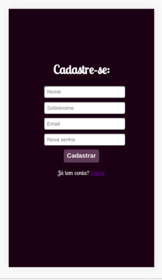

# Rede Social - Escamb
## O projeto
Neste projeto de Rede Social construímos uma cuja temática é **trocas**, no qual o objetivo é o usuário poder relacionar tanto objetos que queira trocar, bem como as experiencias que queira interagir para aprender algo ensinando outra coisa em troca. 

## Características técnicas 
Nós utilizamos o HTML5, CCS3, JavaScript(ES6+) e LocalStorage para desenhar estrutura de dados  que se relacionou com as funcionalidades geridas nas historias dos usuários. Também foi dado enfoque no mobile first, sendo para isso utilizado flexbox.  

## Planejamento

baseado nas histórias dos usuários fizemos as funcionalidades  da **HISTÓRIA DE USUÁRIO 1:** 
  * Criar uma conta com email e senha válidos para poder iniciar uma sessão e ingressar na Rede Social.

 **HISTÓRIA DE USUÁRIO 2:** 
  * Como usuário logado devo poder criar, guardar, modificar no mesmo lugar (in place) e deletar publicações (post) públicas, do mais recente para o mais antigo.

 **HISTÓRIA DE USUÁRIO 3:** 
* Como usuário logado, posso escrever, salvar, editar ou deletar e poder comentar em minhas publicações.

## Desenvolvimento Front-end

* Tela mobile login

    

* Tela Desktop login

    

* Tela do cadastro

    

* Tela mobile home

    

* Tela Desktop home

    

***

